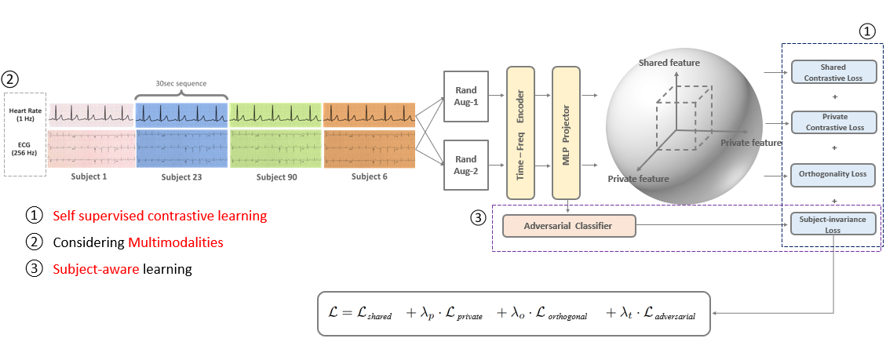
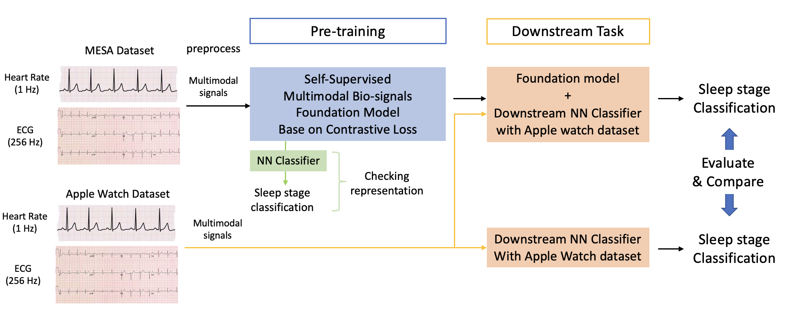
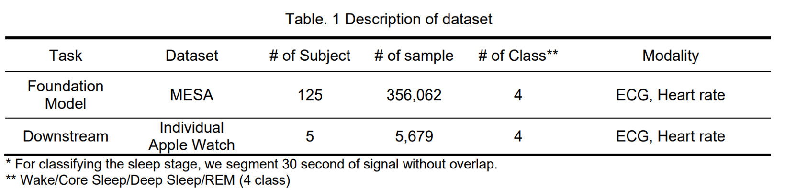

# Foundation Model for Biosignal


# FMBIO-Model
**FMBIO-Model** to-do: explain FMBIO-Model

## Abstract
We will attempt to develop the foundation model using bio-signal (ECG, Heart Rate) [1] for applying the sleep stage classification from the personal data of edge devices [2], such as Apple Watch or Fit-bit. It is hard to get high performance by only using personally own data from edge devices and to train the model, as limitation of the amount of data for train and low hardware resources of edge devices. We expect that the foundation model generates informative representative feature from large bio-signal dataset, and it can improve the downstream task in the restricted environment that people cannot share bio-signal data to others.

## Overview

Our framework has two main strategies:
- MultiModalLoss: develop the foundation model using bio-signal (ECG, Heart Rate)
- Subject-Invariant: 


## Environment setup
create and activate conda environment named ```FMBIO``` with ```python=3.8.18```
```sh
conda activate FMBIO
pip install -r requirements.txt
```

## Dataset
We used two dataset **MESA** dataset and **Apple Watch** dataset. The description of dataset is below.

Due to access issue, the MESA dataset [MESA Dataset](https://sleepdata.org/datasets/mesa) cannot share to others. In addition, we only share 1 subject Apple Watch dataset for demo.


## Preprocessing
The pre-processing scripts are included in this repo.
For preprocessing the MESA dataset and Apple Watch dataset, we cited https://github.com/ojwalch/sleep_classifiers/tree/main


